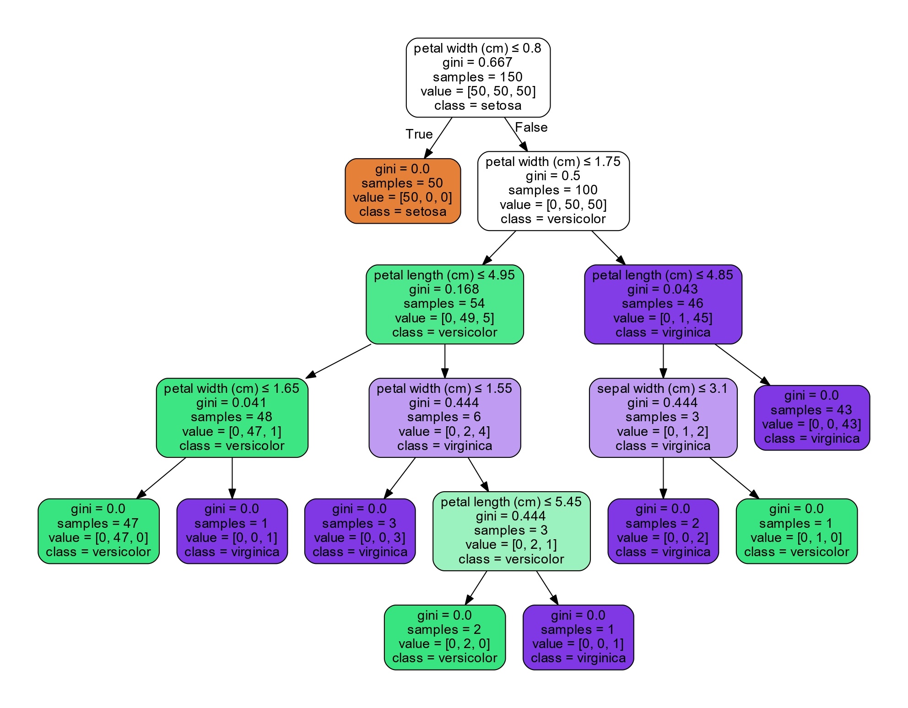
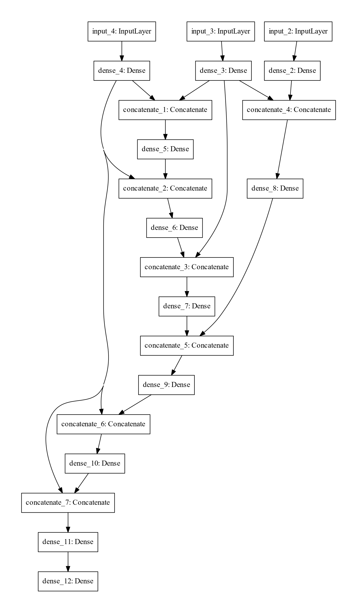

# DNN_and_DT
Create Dense Neural Neural with a decision tree architecture

### Download the dataset:
* Download the dataset from [here](https://drive.google.com/drive/folders/1cr3L_qjH5-QF0zj-A2PSdlE6gfU1R3xs?usp=sharing)

* Or download the dataset with the link from the datasets_link.txt
* Move the downloaded file to the datasets directory inside this repository
* Untar the file

### Train models
* To train models on all dataset, just `cd` into the `scripts/` directory and run the main.py file using :

`python3 main.py` 

### Neural Network Architecture
First, it learns a decision tree.

Then, from the tree the architecture of the dense neural network is defined.
{:height="50%" width="50%"}

